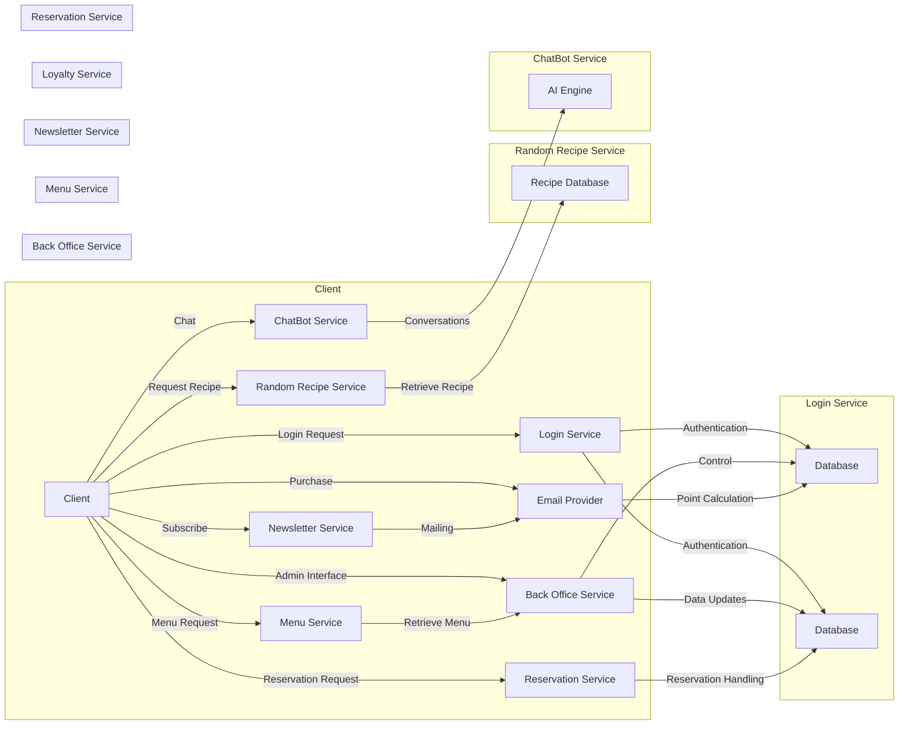
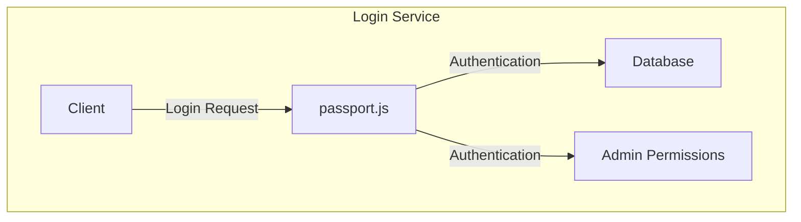
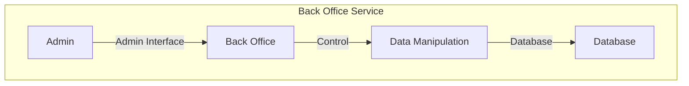
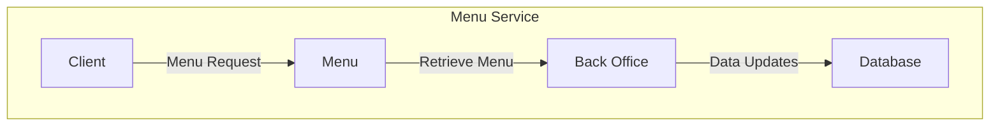
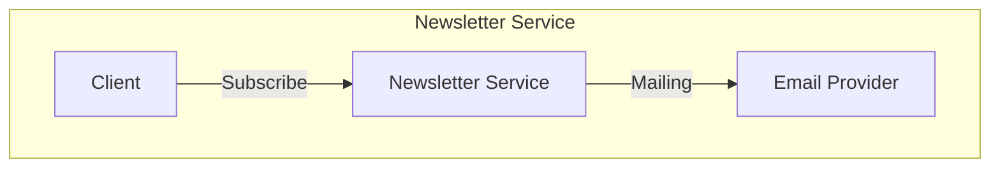
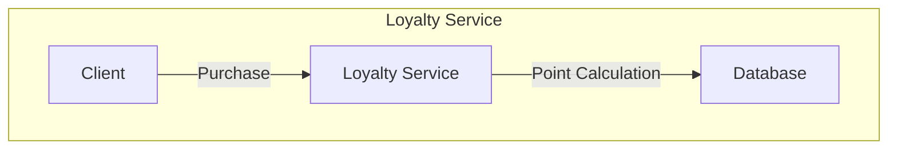
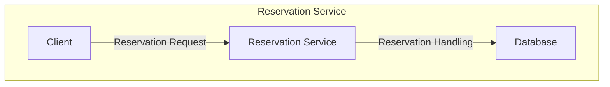
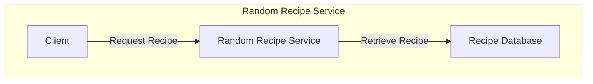
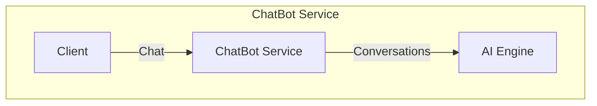

# Mon Projet de Restaurant

Ce projet utilise plusieurs microservices pour gérer divers aspects de l'opération d'un restaurant. Les technologies utilisées incluent MermaidJS pour la visualisation des microservices et Passport.js pour l'authentification.

## Diagramme de flux des microservices

Ce document présente une vue d'ensemble des microservices qui composent le projet. Chaque microservice est représenté graphiquement à l'aide de Mermaid.js pour une meilleure compréhension.

## Compositon Micros Services : 

## Login utilisateur et admin à l'aide de passport.js

## Administration Back Office

## Liste des menus avec mise à jour des plats ajoutés par le Back Office

## Service de newsletters (mailing)

## Service de compte de fidélité (système par points)

## Service de réservations (pour réserver un créneau horaire et manger sur place)

## Service de recette aléatoire

## ChatBot

## Description de chaque microservice:

Login utilisateur et admin : Ce microservice utilise Passport.js pour gérer l'authentification des utilisateurs et des administrateurs. Il gère également la session de l'utilisateur et la persistance des données.
 
Administration Back Office : Ce microservice permet aux administrateurs de gérer les menus et les plats. Il fournit une interface pour ajouter, modifier et supprimer des éléments de menu.

Liste des menus avec mise à jour des plats ajoutés par le back office : Ce microservice gère la liste des menus et des plats disponibles. Il met à jour la liste en fonction des modifications apportées par le Back Office.

Service de newsletters (mailing) : Ce microservice gère l'envoi de newsletters aux utilisateurs. Il peut être utilisé pour envoyer des promotions, des mises à jour de menu, etc.

Service de compte de fidélité (système par points) : Ce microservice gère le système de compte de fidélité. Il attribue des points aux utilisateurs en fonction de leurs achats et des actions qu'ils effectuent sur le site.

Service de reservations (pour reserver un créneau horaire et manger sur place) : Ce microservice gère les réservations de tables. Il permet aux utilisateurs de réserver un créneau horaire et de réserver une table pour manger sur place.

Service de recette aléatoire : Ce microservice propose une recette aléatoire à chaque utilisateur. Il peut être utilisé pour encourager les utilisateurs à essayer de nouveaux plats.

ChatBot : Ce microservice fournit un chatbot pour répondre aux questions des utilisateurs et les aider à naviguer sur le site.